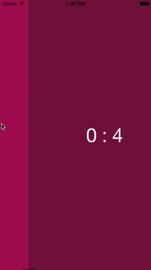
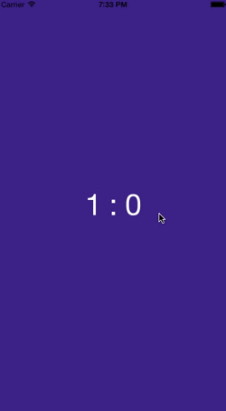

# CollectionViewPageFlowLayout

CollectionViewPageFlowLayout is a _paged_ collection view flow layout in Swift

## Usage

In any `UICollectionViewController` (or any `UIViewController` with a `UICollectionView`) create a `CollectionViewPageFlowLayout` instance and assign it to the `collectionViewLayout` property of the `UICollectionView`.

``` swift
let pagedLayout = CollectionViewPageFlowLayout()
self.collectionView.collectionViewLayout = pagedLayout
```

That's it. Now you don't have to worry about the size changes of your collection view or the interface orientation of your view controller. The layout will always make sure it's _paged_.



### Page separators

Out of the box, the layout will make it look like your collection view's _pages_ are stuck together. There are no margins between them. You can change this by setting the `minimumLineSpacing` property to a non-zero value. This will add spaces before and after the collection view items. Of course, you don't have to worry about the item size. The layout will take care of that for you. Just make sure you resize your collection view beyond it's superview so that the spaces are only visible while scrolling.

``` swift
self.collectionView.frame = CGRectInset(self.view.bounds, -2, 0)
let pageLayout = self.collectionView.collectionViewLayout as CollectionViewPageFlowLayout
pageLayout.minimumLineSpacing = 4
```
